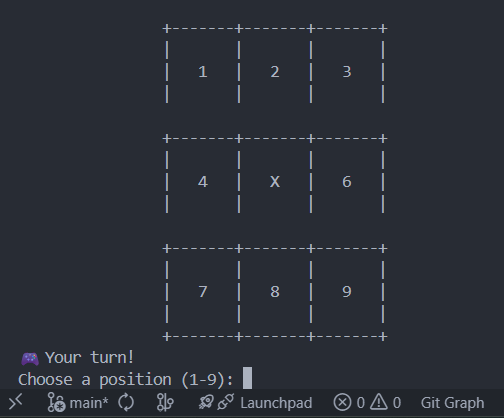
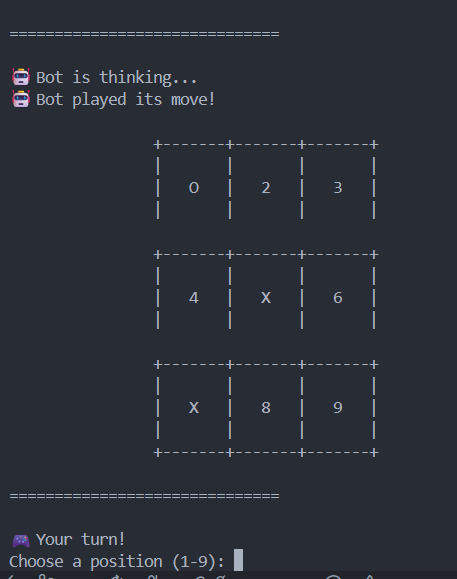
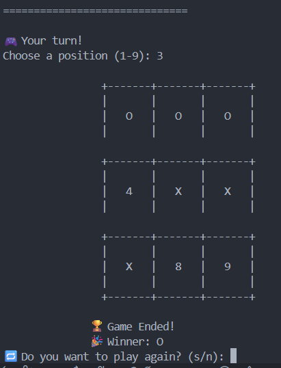

# Build a Pyramid Generator

## Problem

Tu tarea es escribir un simple programa que simule jugar a tic-tac-toe (nombre en inglés) con el usuario. Para hacerlo más fácil, hemos decidido simplificar el juego. Aquí están nuestras reglas:

- la maquina (por ejemplo, el programa) jugará utilizando las 'X's;
- el usuario (por ejemplo, tu) jugarás utilizando las 'O's;
- el primer movimiento es de la maquina - siempre coloca una 'X' en el centro del tablero;
- todos los cuadros están numerados comenzando con el 1 (observa el ejemplo para que tengas una referencia)
- el usuario ingresa su movimiento introduciendo el número de cuadro elegido - el número debe de ser valido, por ejemplo un valor entero mayor que 0 y menor que 10, y no puede ser un cuadro que ya esté ocupado;
- el programa verifica si el juego ha terminado - existen cuatro posibles veredictos: el juego continua, el juego termina en empate, tu ganas, o la maquina gana;
- la maquina responde con su movimiento y se verifica el estado del juego;
- no se debe implementar algún tipo de inteligencia artificial - la maquina elegirá un cuadro de manera aleatoria, eso es suficiente para este juego.

El ejemplo del programa es el siguiente:

### Requirements

Implementa las siguientes características:

- el tablero debe ser almacenado como una lista de tres elementos, mientras que cada elemento es otra lista de tres elementos (la lista interna representa las filas) de manera que todos los cuadros puedas ser accedidos empleado la siguiente sintaxis:
- cada uno de los elementos internos de la lista puede contener 'O', 'X', o un digito representando el número del cuadro (dicho cuadro se considera como libre)
- la apariencia de tablero debe de ser igual a la presentada en el ejemplo.
- implementa las funciones definidas para ti en el editor.

Para obtener un valor numérico aleatorio se puede emplear una función integrada de Python denominada randrange(). El siguiente ejemplo muestra como utilizarla (El programa imprime 10 números aleatorios del 1 al 8).

Nota: la instrucción from-import provee acceso a la función randrange definida en un módulo externo de Python denominado random.

`
from random import randrange

for i in range(10):
print(randrange(8))
`

---

## Solution

See `solution.py`

---
## 🧪 Demo

### Estado inicial

### Jugada del usuario

### Final del juego
